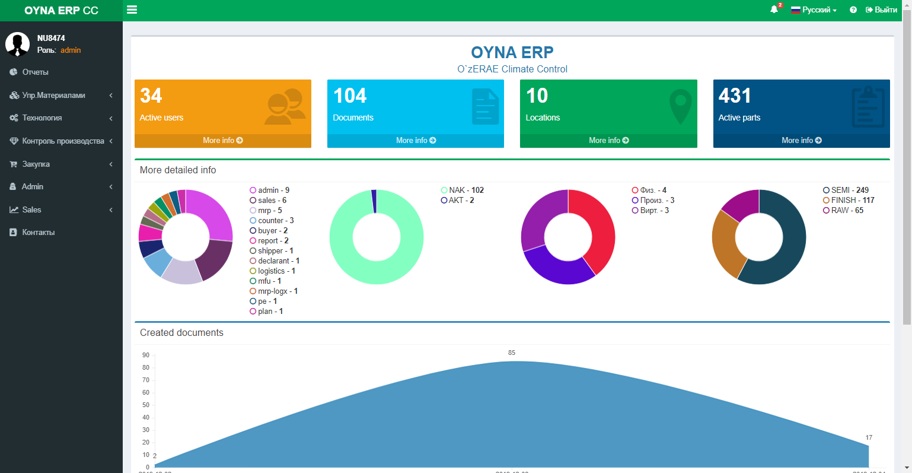

# SCMS - Supply Chain Management System

[](https://travis-ci.org/letsencrypt/boulder)
[](https://coveralls.io/r/letsencrypt/boulder)

The custom project to control Supply Chain related workflow of mini suppliers.

## Contents

* [INTRODUCTION](#introduction)
* [Installation](#installation)


#### Introduction
Small ERP(Enterprise Resource Planning) system. 
Features: 
* Product design
* Material Management
* Production Planning and Execution
* Reporting
* Sales and Distribution

## Installation

### Requirements
* Access to internet
* Install OpenServer  
* Install Git
* Install Composer

### Open server installation:
* Download Basic version from `https://ospanel.io/download/`
* Install open_server_X_Y_Z_basic. `https://ospanel.io/docs/`
* Run 'Open Server x64.exe'
* Select language
* Install additional software if required
* Apache configuration: 
	* error_reporting = E_ALL
	
 
### Steps:


* clone project from repository. `git clone https://github.com/MSherali/UMSSC.git`
* Create `uploads` folder on root directory
* Create `runtime/session` folder into `_protected` 
* `chmod 777 ./_protected/runtime`
* `chmod 777 ./_protected/runtime/mail`
* `chmod 777 ./_protected/runtime/session`
* `chmod 755 ./_protected/yii`
* `chmod 777 ./assets`
* `chmod 777 ./uploads`
* create `env.php` with 
	```    
		<?php
		defined('YII_DEBUG') or define('YII_DEBUG', false);
		defined('YII_ENV') or define('YII_ENV', 'prod');
	```
* Copy config folder from local to server
* composer update
* Get Admin user credentials from AD administrator
* Fill AD `account_suffix` on `app\_protected\config\params.php`
* Fill `app\_protected\config\ad.php` file with AD Admin user credentials
* Create database using phpmyadmin 
* Fill `app\_protected\config\db.php` with database user credentials
* `cd _protected`
* `yii migrate`
* `yii db/create-admin :username`
* `yii db/seed-all`
* `cd _protected`
* apply migrations:
	#### `yii migrate`
* seed Admin user:
	#### `yii db/create-admin :username`
* seed initial data(unit, report, document_types, ship_mode, consolidation_type, delivery_term, payment_term) using 
	#### `yii db/seed-all`


[](http://www.yiiframework.com/)


